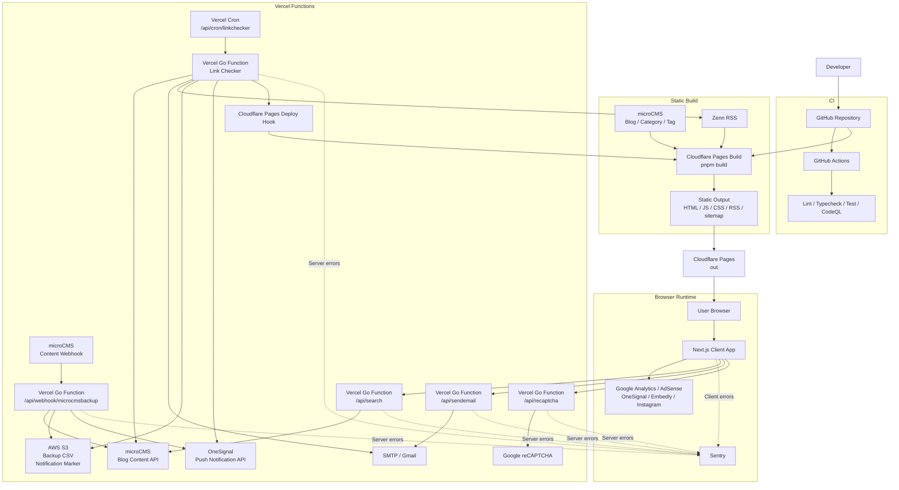

<div id="top"></div>

<div align="right">


</div>


## 目次

- [リアル大学生](#top)
  - [目次](#目次)
  - [リンク一覧](#リンク一覧)
  - [主な機能一覧](#主な機能一覧)
  - [使用技術](#使用技術)
  - [アーキテクチャ](#アーキテクチャ)
  - [環境構築](#環境構築)
  - [Terraform](#terraform)
  - [テスト](#テスト)
  - [ディレクトリ構成](#ディレクトリ構成)
  - [Gitの運用](#Gitの運用)
    - [ブランチ](#ブランチ)
    - [コミットメッセージの記法](#コミットメッセージの記法)

## リンク一覧

<ul><li><a href="https://realunivlog.com">リアル大学生</a></li></ul>
<ul><li><a href="https://www.figma.com/design/Fa4LsgTvBhWAu4sIcwYy1O/NextBlogApp?node-id=0-1&node-type=canvas&t=zcqCjvUj22ccvYpV-11">Figma</a></li></ul>

<p align="right">(<a href="#top">トップへ</a>)</p>

## 主な機能一覧

※本番環境ではGoogle AdSenseによる広告が表示されます。

| 最新記事ページ                     | 　カテゴリーページ                               |
| ---------------------------------- | ------------------------------------------------ |
|    |                  |
| 最新記事を一覧表示するページです。 | 特定のカテゴリーの記事を一覧表示するページです。 |

| タグページ                                 | お問い合わせページ                   |
| ------------------------------------------ | ------------------------------------ |
|            |      |
| 特定のタグの記事を一覧表示するページです。 | 管理者にお問い合わせするページです。 |

| アーカイブページ                           | 　記事ページ                     |
| ------------------------------------------ | -------------------------------- |
|            |  |
| 特定の年月の記事を一覧表示するページです。 | 記事を表示するページです。       |

| サイトマップ・RSS                            | 　ダークテーマ                                         |
| -------------------------------------------- | ------------------------------------------------------ |
|              |                        |
| XML形式のサイトマップとRSSを公開しています。 | ライトテーマとダークテーマを切り替えることができます。 |

<p align="right">(<a href="#top">トップへ</a>)</p>

## 使用技術

| Category          | Technology Stack                               |
| ----------------- | ---------------------------------------------- |
| Frontend          | Next.js, React, TypeScript, Tailwind CSS       |
| Backend           | Go, Vercel Functions                           |
| CMS               | microCMS, Zenn RSS                             |
| Infrastructure    | Cloudflare Pages, Vercel, Amazon S3, Terraform |
| Environment setup | Docker                                         |
| CI/CD             | GitHub Actions, CodeQL, Dependabot             |
| Design            | Canva                                          |
| Google            | AdSense, Analytics, Search Console, reCAPTCHA  |
| Integrations      | PWA, OneSignal, Sentry                         |

<p align="right">(<a href="#top">トップへ</a>)</p>

## アーキテクチャ



<p align="right">(<a href="#top">トップへ</a>)</p>

## 環境構築

```
# リポジトリのクローン
git clone git@github.com:Arata1202/NextBlogApp.git
cd NextBlogApp

# .env.exampleから.envを作成
mv .env.example .env

# .envの編集
vi .env

# コンテナのビルドと起動
docker compose up -d --build

# ブラウザにアクセス
http:localhost:3000

# コンテナの停止
docker compose down
```

<p align="right">(<a href="#top">トップへ</a>)</p>

## Terraform

```
# Terraformディレクトリへ移動
cd terraform

# terraform.tfvars.exampleからterraform.tfvarsを作成
cp terraform.tfvars.example terraform.tfvars

# terraform.tfvarsの編集
vi terraform.tfvars

# Terraformの初期化
terraform init

# 変更内容の確認
terraform plan

# AWSリソースの作成・更新
terraform apply
```

<p align="right">(<a href="#top">トップへ</a>)</p>

## テスト

```
# Lint / 型チェック / ユニットテスト
pnpm lint
pnpm typecheck
pnpm test:run

# Playwright のブラウザをインストール
pnpm exec playwright install chromium

# E2E用の固定データで静的ビルド
pnpm build:e2e

# E2Eテスト
pnpm test:e2e

# 既存のローカルサーバーを再利用してE2Eテストを実行
PLAYWRIGHT_REUSE_SERVER=1 pnpm test:e2e

# E2Eテストをブラウザ表示ありで実行
pnpm test:e2e:headed

# E2Eレポートを表示
pnpm test:e2e:report
```

<p align="right">(<a href="#top">トップへ</a>)</p>

## ディレクトリ構成

```
❯ tree -a -I "node_modules|.next|.git|out|.vercel|_|.DS_Store|.env|next-env.d.ts|tmp|coverage|tsconfig.tsbuildinfo|playwright-report|test-results|.pnpm-store|.terraform|terraform.tfstate|terraform.tfstate.backup|terraform.tfvars" -L 3
.
├── .air.toml
├── .docker
│   ├── go
│   │   └── Dockerfile
│   └── js
│       └── Dockerfile
├── .dockerignore
├── .docs
│   └── readme
│       └── images
├── .env.example
├── .github
│   ├── dependabot.yml
│   └── workflows
│       ├── codeql.yml
│       ├── test.yml
│       └── vercel_deploy.yml
├── .gitignore
├── .husky
│   └── pre-commit
├── .npmrc
├── .nvmrc
├── .prettierignore
├── .prettierrc
├── .vercelignore
├── .vscode
│   ├── extensions.json
│   └── settings.json
├── LICENSE
├── README.md
├── api
│   ├── cron
│   │   ├── linkchecker.go
│   │   ├── linkchecker_test.go
│   │   └── zennnotifier_test.go
│   ├── monitoring
│   │   └── sentry.go
│   ├── recaptcha.go
│   ├── recaptcha_test.go
│   ├── search.go
│   ├── search_test.go
│   ├── sendemail.go
│   ├── sendemail_test.go
│   └── webhook
│       ├── microcmsbackup.go
│       └── microcmsbackup_test.go
├── cmd
│   └── main.go
├── docker-compose.yml
├── e2e
│   ├── contact.spec.ts
│   ├── feeds.spec.ts
│   ├── fixtures
│   │   ├── content.d.mts
│   │   └── content.mjs
│   ├── navigation.spec.ts
│   ├── responsive.spec.ts
│   ├── search.spec.ts
│   ├── smoke.spec.ts
│   ├── support
│   │   └── app.ts
│   └── theme.spec.ts
├── eslint.config.mjs
├── go.mod
├── go.sum
├── next.config.ts
├── package.json
├── playwright.config.ts
├── pnpm-lock.yaml
├── postcss.config.mjs
├── public
│   ├── OneSignalSDKWorker.js
│   ├── ads.txt
│   ├── app-ads.txt
│   ├── favicon.ico
│   ├── images
│   │   ├── blog
│   │   ├── head
│   │   ├── plugin
│   │   ├── post
│   │   ├── pwa
│   │   └── thumbnail
│   ├── llms-full.txt
│   ├── llms.txt
│   └── robots.txt
├── scripts
│   └── e2e
│       ├── build.mjs
│       ├── mock-fetch.mjs
│       └── serve-static.mjs
├── src
│   ├── app
│   │   ├── __tests__
│   │   ├── archive
│   │   ├── articles
│   │   ├── category
│   │   ├── contact
│   │   ├── copyright
│   │   ├── disclaimer
│   │   ├── global-error.tsx
│   │   ├── layout.module.css
│   │   ├── layout.tsx
│   │   ├── link
│   │   ├── manifest.json
│   │   ├── not-found.module.css
│   │   ├── not-found.tsx
│   │   ├── p
│   │   ├── page.tsx
│   │   ├── privacy
│   │   ├── profile
│   │   ├── rss.xml
│   │   ├── search
│   │   ├── sitemap-html
│   │   ├── sitemap.ts
│   │   └── tag
│   ├── components
│   │   ├── Common
│   │   ├── Features
│   │   ├── Pages
│   │   └── ThirdParties
│   ├── config
│   │   ├── publicEnv.ts
│   │   └── serverEnv.ts
│   ├── constants
│   │   ├── articleContent.ts
│   │   ├── category.ts
│   │   ├── customHtml.ts
│   │   ├── data.ts
│   │   ├── limit.ts
│   │   └── page.ts
│   ├── contents
│   │   ├── copyright.ts
│   │   ├── disclaimer.ts
│   │   ├── link.ts
│   │   ├── privacy.ts
│   │   └── profile.ts
│   ├── contexts
│   │   ├── ThemeProvider.tsx
│   │   ├── ThemeWrapper.tsx
│   │   └── __tests__
│   ├── hooks
│   │   ├── __tests__
│   │   ├── useCodeBlockCopyButtons.tsx
│   │   ├── useExtractHeadings.ts
│   │   ├── useIframelyEmbeds.ts
│   │   ├── useIsClient.ts
│   │   └── useMutationObserver.ts
│   ├── instrumentation-client.ts
│   ├── libs
│   │   ├── __tests__
│   │   ├── archive.ts
│   │   ├── microcms.ts
│   │   ├── microcmsPage.ts
│   │   ├── pageData.ts
│   │   ├── recent.ts
│   │   ├── rss.ts
│   │   ├── unified.ts
│   │   └── zenn.ts
│   ├── styles
│   │   ├── globals.css
│   │   └── plugin.css
│   ├── test
│   │   ├── factories.ts
│   │   └── setup.ts
│   ├── types
│   │   ├── form.ts
│   │   ├── heading.ts
│   │   ├── microcms.ts
│   │   ├── react-dom-client.d.ts
│   │   └── unified.ts
│   └── utils
│       ├── __tests__
│       ├── formatDate.ts
│       ├── formatHeadings.ts
│       ├── formatMicroCmsImageUrl.ts
│       ├── formatRichText.ts
│       ├── markdownHeadings.ts
│       ├── sanitizeCustomHtml.ts
│       └── urlSafety.ts
├── terraform
│   ├── .terraform.lock.hcl
│   ├── iam
│   │   ├── iam.tf
│   │   └── variables.tf
│   ├── main.tf
│   ├── module.tf
│   ├── s3
│   │   ├── s3.tf
│   │   └── variables.tf
│   ├── terraform.tfvars.example
│   └── variables.tf
├── tsconfig.json
├── vercel.json
└── vitest.config.mts

68 directories, 127 files
```

<p align="right">(<a href="#top">トップへ</a>)</p>

## Gitの運用

### ブランチ

GitHub Flowを使用する。
masterとfeatureブランチで運用する。

| ブランチ名 |   役割   | 派生元 | マージ先 |
| :--------: | :------: | :----: | :------: |
|   master   | 本番環境 |   -    |    -     |
| feature/\* | 機能開発 | master |  master  |

### コミットメッセージの記法

```
fix: バグ修正
feat: 新機能追加
perf: パフォーマンス改善
refactor: コードのリファクタリング
docs: ドキュメントのみの変更
style: コードのフォーマットに関する変更
test: テストコードの変更
build: ビルドシステムや依存関係の変更
ci: CI/CD設定の変更
revert: 変更の取り消し
chore: その他の変更
```

<p align="right">(<a href="#top">トップへ</a>)</p>
