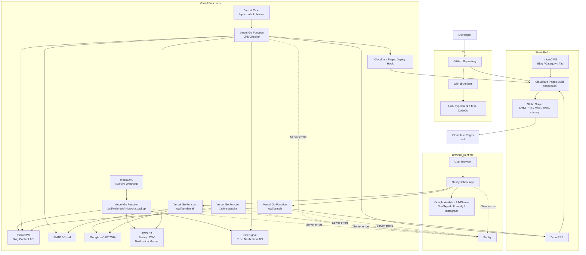

<div id="top"></div>

<div align="right">


</div>


## 目次

- [リアル大学生](#top)
  - [目次](#目次)
  - [リンク一覧](#リンク一覧)
  - [使用技術](#使用技術)
  - [アーキテクチャ](#アーキテクチャ)
  - [環境構築](#環境構築)
  - [スポンサー記事](#スポンサー記事)
  - [Storybook](#storybook)
  - [Terraform](#terraform)
  - [テスト](#テスト)
  - [OneSignalテスト通知](#onesignalテスト通知)
  - [ディレクトリ構成](#ディレクトリ構成)
  - [Gitの運用](#gitの運用)
    - [ブランチ](#ブランチ)
    - [コミットメッセージの記法](#コミットメッセージの記法)

## リンク一覧

<ul>
  <li><a href="https://realunivlog.com">リアル大学生</a></li>
  <li><a href="https://www.figma.com/design/Fa4LsgTvBhWAu4sIcwYy1O/NextBlogApp?node-id=2102-4673">Figma（Archived Design Tokens）</a></li>
  <li><a href="https://www.figma.com/design/Fa4LsgTvBhWAu4sIcwYy1O/NextBlogApp?node-id=0-1">Figma（Archived UI）</a></li>
</ul>

<p align="right">(<a href="#top">トップへ</a>)</p>

## 使用技術

| Category          | Technology Stack                               |
| ----------------- | ---------------------------------------------- |
| Frontend          | Next.js, React, TypeScript, Tailwind CSS       |
| Backend           | Go, Vercel Functions                           |
| CMS               | microCMS, Zenn RSS                             |
| Infrastructure    | Cloudflare Pages, Vercel, Amazon S3, Terraform |
| Environment setup | Node.js, pnpm, Docker Compose                  |
| CI/CD             | GitHub Actions, CodeQL, Dependabot             |
| Design            | Storybook, Canva（Figmaはアーカイブ済み）      |
| Google            | AdSense, Analytics, Search Console, reCAPTCHA  |
| Integrations      | PWA, OneSignal, Sentry, Iframely, Instagram    |

<p align="right">(<a href="#top">トップへ</a>)</p>

## アーキテクチャ


```mermaid
flowchart TB
  developer[Developer] --> github[GitHub Repository]

  subgraph ci[CI]
    github --> actions[GitHub Actions]
    actions --> quality[Lint / Typecheck / Test / CodeQL]
  end

  subgraph build[Static Build]
    github --> pagesBuild[Cloudflare Pages Build<br/>pnpm build]
    microcms[microCMS<br/>Blog / Category / Tag] --> pagesBuild
    zenn[Zenn RSS] --> pagesBuild
    pagesBuild --> generated[Static Output<br/>HTML / JS / CSS / RSS / sitemap]
  end

  generated --> pages[Cloudflare Pages<br/>out]
  pages --> browser[User Browser]

  subgraph runtime[Browser Runtime]
    browser --> app[Next.js Client App]
    app --> thirdParty[Google Analytics / AdSense<br/>OneSignal / Iframely / Instagram]
    app -. Client errors .-> sentry[Sentry]
  end

  subgraph vercelFunctions[Vercel Functions]
    app --> searchApi[Vercel Go Function<br/>/api/search]
    searchApi --> microcmsBlogContentApi[microCMS<br/>Blog Content API]
    searchApi --> zenn
    app --> sendEmailApi[Vercel Go Function<br/>/api/sendemail]
    recaptchaApi[Vercel Go Function<br/>/api/recaptcha]
    sendEmailApi --> smtp[SMTP / Gmail]
    sendEmailApi --> recaptcha[Google reCAPTCHA]
    recaptchaApi --> recaptcha
    cron[Vercel Cron<br/>/api/cron/linkchecker] --> linkcheckerApi[Vercel Go Function<br/>Link Checker]
    linkcheckerApi --> microcmsBlogContentApi
    linkcheckerApi --> smtp
    linkcheckerApi --> zenn
    linkcheckerApi --> s3
    linkcheckerApi --> oneSignalApi
    linkcheckerApi --> pagesDeployHook[Cloudflare Pages Deploy Hook]
    pagesDeployHook --> pagesBuild
    microcmsWebhook[microCMS<br/>Content Webhook] --> microcmsbackupApi[Vercel Go Function<br/>/api/webhook/microcmsbackup]
    microcmsbackupApi --> microcmsBlogContentApi
    microcmsbackupApi --> s3[AWS S3<br/>Backup CSV<br/>Notification Marker]
    microcmsbackupApi --> oneSignalApi[OneSignal<br/>Push Notification API]
  end

  searchApi -. Server errors .-> sentry
  sendEmailApi -. Server errors .-> sentry
  recaptchaApi -. Server errors .-> sentry
  linkcheckerApi -. Server errors .-> sentry
  microcmsbackupApi -. Server errors .-> sentry
```

<p align="right">(<a href="#top">トップへ</a>)</p>

## 環境構築

Node.jsは`.nvmrc`、pnpmは`package.json`の`packageManager`に記載されたバージョンを使用する。通常はフロントエンドをホスト上、Go APIをDocker上で起動する。`docker-compose.yml`の`js`サービスは、フロントエンドもコンテナで起動したい場合の代替手段として利用できる。

```bash
# リポジトリのクローン
git clone git@github.com:Arata1202/NextBlogApp.git
cd NextBlogApp

# .env.exampleから.envを作成
cp .env.example .env

# 利用する機能に必要な環境変数を設定
vi .env

# フロントエンドの依存関係をインストール
corepack enable
pnpm install --frozen-lockfile

# Go APIをDockerで起動
docker compose up -d --build go

# フロントエンドをホスト上で起動
pnpm dev
```

ブラウザで <http://localhost:3000> にアクセスする。ローカルのGo APIをフロントエンドから利用する場合は、`.env`に次のURLを設定する。

```dotenv
NEXT_PUBLIC_API_SEARCH_URL=http://localhost:8000/api/search
NEXT_PUBLIC_API_SENDEMAIL_URL=http://localhost:8000/api/sendemail
```

```bash
# Go APIを停止
docker compose down
```

<p align="right">(<a href="#top">トップへ</a>)</p>

## スポンサー記事

microCMSの`blog` APIに以下のフィールドを追加する。

| フィールドID  | 種類     | 設定                  |
| ------------- | -------- | --------------------- |
| `isSponsored` | 真偽値   | 初期値を`false`にする |
| `sponsorUrl`  | テキスト | 広告主の公式URL       |

`isSponsored`を有効にした記事では、一覧と記事上部にPR表示が追加され、記事上部に「本記事は、広告主から依頼を受けて制作した広告です。」と表示される。本文中のリンクは、`sponsorUrl`と同じドメインまたはそのサブドメインに限り`rel="sponsored"`が付与される。

スポンサー記事では有効な`sponsorUrl`が必須となり、不足している場合はビルドが失敗する。

スポンサー記事は、初回公開時のOneSignalプッシュ通知から自動的に除外される。

<p align="right">(<a href="#top">トップへ</a>)</p>

## Storybook

共通UIと主要な表示状態はStorybookで確認する。ツールバーからLight／Darkテーマを切り替えられ、AccessibilityパネルとブラウザテストでWCAG違反や操作を検証できる。

```bash
# Storybookを起動
pnpm storybook

# 静的Storybookを生成
pnpm build-storybook

# StoryとアクセシビリティをChromiumで検証
pnpm test:storybook
```

Storyは対象コンポーネントと同じディレクトリの`index.stories.tsx`へ配置する。基礎スタイルと共通fixtureは`src/stories/`で管理する。

<p align="right">(<a href="#top">トップへ</a>)</p>

## Terraform

```
# Terraformディレクトリへ移動
cd terraform

# terraform.tfvars.exampleからterraform.tfvarsを作成
cp terraform.tfvars.example terraform.tfvars

# terraform.tfvarsの編集
vi terraform.tfvars

# Terraformの初期化
terraform init

# 変更内容の確認
terraform plan

# AWSリソースの作成・更新
terraform apply
```

<p align="right">(<a href="#top">トップへ</a>)</p>

## テスト

```bash
# Lint / 型チェック / ユニットテスト
pnpm lint
pnpm typecheck
pnpm test:run

# Storybookの静的ビルド / ブラウザテスト
pnpm build-storybook
pnpm test:storybook

# Goの静的解析 / テスト（Docker）
docker compose run --rm go go vet ./...
docker compose run --rm go go test ./...

# Playwright のブラウザをインストール
pnpm exec playwright install chromium

# E2Eテスト（固定データのビルドとテストサーバーの起動を含む）
pnpm test:e2e

# E2Eテストをブラウザ表示ありで実行
pnpm test:e2e:headed

# E2Eレポートを表示
pnpm test:e2e:report
```

<p align="right">(<a href="#top">トップへ</a>)</p>

## OneSignalテスト通知

GitHub Actionsの`OneSignal Test Notification`から、`Test Users`セグメントへブログ／Zenn × Web／iOSの4種類のテスト通知を送信できる。

事前にGitHubの`onesignal-test` Environmentを作成し、Deployment branches and tagsを`master`のみに制限したうえで、次のSecretsを登録する。必要に応じてEnvironmentにRequired reviewersも設定する。

- `ONESIGNAL_APP_ID`
- `ONESIGNAL_REST_API_KEY`

Actionsの`Run workflow`では、ペイロードだけを表示する`dry-run`が既定値になっている。実際に通知するときだけ`master`ブランチで`send`を選択する。`master`以外からの送信指定はワークフローを失敗させる。送信先セグメントはスクリプト内で`Test Users`に固定している。

ローカルでは次のコマンドで同じテストを実行できる。

```bash
# ペイロードの確認（--dry-runは省略可）
scripts/send-onesignal-test-notifications.sh

# Test Usersへ送信
scripts/send-onesignal-test-notifications.sh --send
```

<p align="right">(<a href="#top">トップへ</a>)</p>

## ディレクトリ構成

```text
.
├── .github/workflows/  # CI/CD・運用ワークフロー
├── .storybook/         # Storybook設定
├── api/                # Vercel Functionsのエントリーポイント
├── cmd/                # ローカルGo APIサーバー
├── docker/             # 開発用Dockerイメージ
├── docs/                # READMEなどのドキュメント資産
├── e2e/                 # Playwright E2Eテスト
├── pkg/api/             # Go APIの実装
├── public/              # 静的ファイル
├── scripts/             # E2E・運用スクリプト
├── src/
│   ├── app/             # Next.js App Router
│   ├── components/      # UIコンポーネント
│   ├── stories/         # 基礎スタイル・共通Story fixture
│   ├── config/          # 環境変数の参照
│   ├── contents/        # 固定ページのコンテンツ
│   ├── hooks/           # React Hooks
│   ├── libs/            # データ取得・変換
│   ├── styles/          # グローバルスタイル・共通UI定義
│   ├── types/           # TypeScriptの型定義
│   └── utils/           # 汎用処理
└── terraform/           # AWSリソース定義
```

<p align="right">(<a href="#top">トップへ</a>)</p>

## Gitの運用

### ブランチ

GitHub Flowを使用する。
masterとfeatureブランチで運用する。

| ブランチ名 |   役割   | 派生元 | マージ先 |
| :--------: | :------: | :----: | :------: |
|   master   | 本番環境 |   -    |    -     |
| feature/\* | 機能開発 | master |  master  |

### コミットメッセージの記法

```
fix: バグ修正
feat: 新機能追加
perf: パフォーマンス改善
refactor: コードのリファクタリング
docs: ドキュメントのみの変更
style: コードのフォーマットに関する変更
test: テストコードの変更
build: ビルドシステムや依存関係の変更
ci: CI/CD設定の変更
revert: 変更の取り消し
chore: その他の変更
```

<p align="right">(<a href="#top">トップへ</a>)</p>
